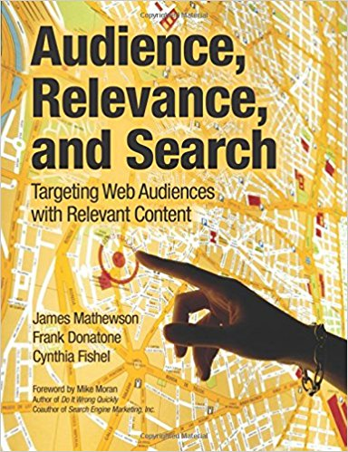

# Findability as a service

## Holistic understanding of SEO

- Search is experienced as a whole process
- The phases influence each other
- Time and cognitive effort are decisive factors
- The quality of the user experience determines the ranking

## User experience determines SEO success

- Google experiments with web content
- Google measures the user experience
- Good user experience improves the ranking

::: notes

> It is surprisingly easy to create a website that attracts lots of traffic for a short time. It is much harder to create a webproperty that maintains this traffic and manages to improve on it. If the user experience is negative from Google's point of view, you will not keep your traffic

Franz Enzenhofer

:::

## How does the search work and where are the biggest painpoints?

- Touchpoints: Where does the interaction take place?
- Interactions: What do, feel and think the users?
- Backend: What happens at the search engine and server?
- Optimization: How can I influence the process?

## {data-background="pics/search_as_service.png" data-background-size="contain"}

<!--

## Search as a service

-->

## Before the search: the search intention

- Situation
- place and time
- Information, orientation, transaction

::: notes

> A query can range from a word to multiple words to a full sentence. It's rarely even a thought; it's usually half of a thought, one that the user is still thinking. Quite often it's not even spelled right or in a logical order. But every user that googles has an intent: a "job to be done," something they want to achieve. Everybody does it, all the time, without much thinking. They just google.

Franz Enzenhofer

:::

##

> It can be helpful to think of queries as having one or more of the following intents.
> Know query...
> Do query...
> Website query.
> Visit-in-person query, some of which are looking for a specific business or organization, some of which are looking for a category of businesses

[Google Search Quality Evaluator Guidelines](https://static.googleusercontent.com/media/www.google.%20com/de//insidesearch/howsearchworks/assets/searchqualityevaluatorguidelines.pdf)

# Search input

## Search input > Touchpoint

- From the Google homepage to the address bar: Search becomes a browser function
- Voice input: Search as part of Universal Computing
- Finding without searching: search intention is anticipated
- Example: [21 Stats About Voice Search that you Never Knew](http://www.jodynimetz.com/21-stats-about-voice-search-that-you-never-knew)

## Search Entry > Interactions

- Natural language and operators (Advanced Search)
- Text (image input) and data are processed via the client
- Search suggestions are supplemented interactively by the search engine

## Search Entry > Behind the scene

- Semantic interpretation
- Calling up the personalized search history for search proposals

::: notes

> Google takes these chaotic, fragmented and often nonsensical queries, and enriches it with everything they know about the user.

:::

## Search Entry > Optimization

- Keyword Research
- Synonyms/ linguistic alternatives
- Understanding the intentions

## Search input > Optimization > Keywords

- Search engine optimization always starts with the definition of keywords or the questions of the users.
- Search and search behaviour provide the most important data about the users of a website.

## Search input > Optimization > Keyword clouds

- Before writing individual contents, all relevant keywords/questions should be collected.
- Content must be addressable via keywords
- Different contents may not compete with each other for the same keyword.

## Basics about content and searches:

## Most important SEO tool: Google Search Console

## Search Entry > Optimization > Find Keywords

- Analyze search entries
- internal quest
- Forums, service issues, etc.
- Social media
- keyword tools
- Academic: Literature, Google Scholar

## Search Entry > Optimization > Find Keywords

- Free SEO Keyword Tools](http://www.keyword-tools.org/)

- [Google Keyword Planner](https://adwords.google.com/aw/keywordplanner/home?ocid=88008662&__c=9405264038&authuser=0&__u=4127418278) (Manual, updated 2018: [Google Keyword Planner: The ultimate guide [❤ t3n](https://t3n.de/news/google-keyword-planer-anleitung-477330/)

- [Google Trends](https://trends.google.de/trends/?geo=DE)

- [Google Correlate](https://www.google.com/trends/correlate)

- Google Suggest (Depersonalized: Turn off individual search results on Google - computer.daten.netze :: feenders.de - berlin-kreuzberg](https://www.feenders.de/ratgeber/anwender/581-individuelle-suchergebnisse-bei-google-abschalten.html

Translated with www.DeepL.com/Translator (free version)
