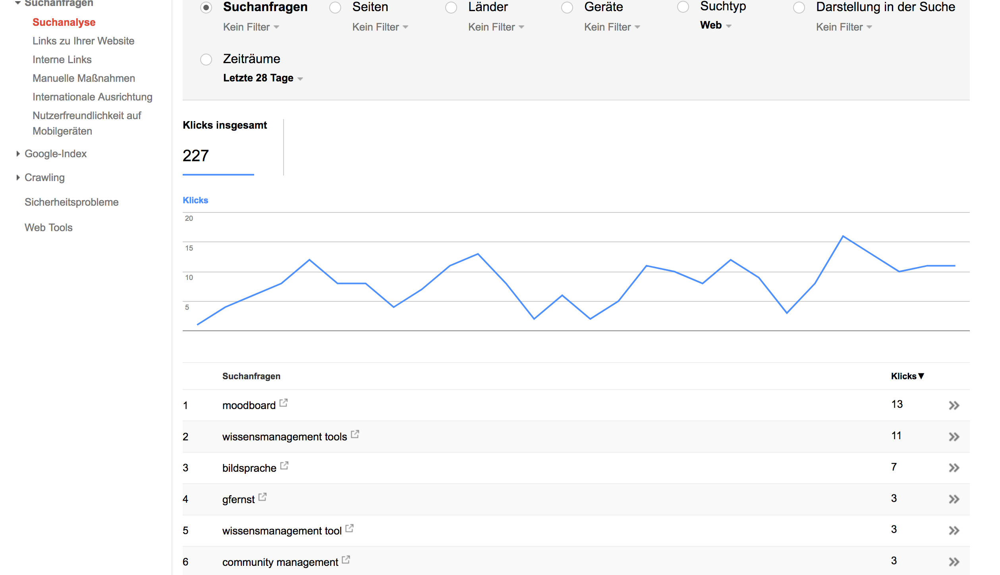
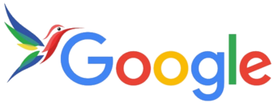
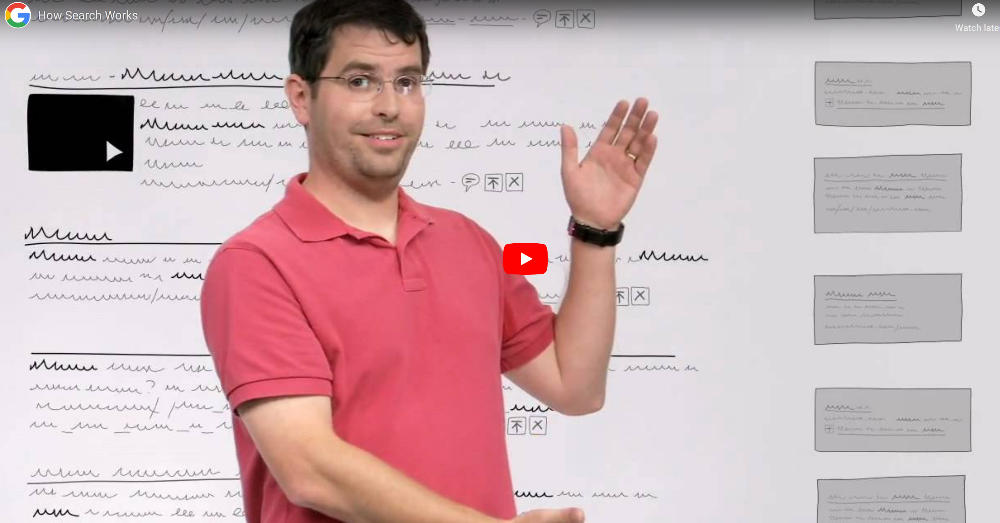

# Einleitung

## Ziele

- Verständnis von SEO als Teil user-orientierten Designs
- Verständnis allgemeiner Grundlagen von Suchmaschinen und SEO

<!--

## Ablauf

|||
|---|---|
|10:00 - 10:15| Vorstellungsrunde, Organisatorisches|
|10:15 - 11:30, 11:45 -13:00| Einführung/Theorie|
|14:00 - 15:00| Probleme der Teilnehmer|
|15:15 - 16:45| Gruppenarbeit: Entwicklung eines SEO-Konzeptes|
|17:00 - 18:00 | Zukunft der Suche|

-->

# Bedeutung der Suche

##

Quelle: [Dries Buytaert: The Big Reverse of the Web](https://dri.es/the-big-reverse-of-the-web)

##

- Suche, Sharen und Abonnieren sind die wichtigsten Zugänge zu Online-Inhalten
- Suche als wichtigster Zugang zu Online-Inhalten
- Durch die Suche steuern die Nutzen den Zugang zu Inhalten

##

- Suche wird ubiquitär
- Suche basiert zunehmend auf semantischer Analyse und Auswertung aller Arten von Daten

::: notes

Wie komme ich analog zu Inhalten? Ich bewege mich zu einem entsprechenden Angebot und suche mir irgendwelche Inhalte aus. Das können die Bücher in einer Buchhandlung oder die Zeitschriften in einem Kiosk sein.

Im Netz gehen wir ganz anders vor, aber wir machen uns den Unterschied oft selbst nicht richtig klar. Im Netz suchen wir gezielt nach Inhalten, wir lassen uns Inhalte, z.b. bei Facebook oder Instagram, empfehlen oder wir abonnieren unsere, spezifisch für uns interessanten QuellenPunkt von diesen drei Zugängen ist die Suche bei weitem der wichtigste.

Wenn ich im Netz publizistisch erfolgreich sein will, also Leute erreichen möchte, muss ich mich auf diese Zugänge einstellen. Meine Inhalte müssen teilbar sein, sie müssen abonnierbar sein oder sie müssen findbar seinPunkt die drei Zugänge lassen sich kombinieren, aber meist sind sie aus gutem Grund getrennt, weil die Interessen ganz unterschiedlich sind, die von den Inhalten jeweils befriedigt werden.

:::

# Keine SEO ohne Business-Strategie

##

> Above the fold rankings (the ones that are visible on a web page without scrolling) are a side effect of successful SEO, but not a goal in their own right.

Franz Enzenhofer

[Understanding SEO - A Systematic Approach to SEO by Franz Enzenhofer](https://www.fullstackoptimization.com/b/understanding-seo "Understanding SEO - A Systematic Approach to SEO by Franz Enzenhofer - fullstackoptimization.com")

##

> SEO in its entirety is and always will be the responsibility of your business

Franz Enzenhofer

::: notes

> If you don’t have a product or don’t have a business goal, then create this first. Then, and only then, should you consider SEO.

Franz Enzenhofer

:::

[Understanding SEO - A Systematic Approach to SEO by Franz Enzenhofer](https://www.fullstackoptimization.com/b/understanding-seo "Understanding SEO - A Systematic Approach to SEO by Franz Enzenhofer - fullstackoptimization.com")

## SEO ist keine Aufgabe für Spezialisten

- Traffic hängt von Inhalt, Marketing und Technik ab
- Alle in einer Organisation müssen SEO-bezogen denken
- SEO-Fachleute müssen vor allem koordinieren und kommunizieren

::: notes

> The biggest risk is that one part does not want to “get found” or just does not commit to the goal of “getting found.”

F. Enzenhofer

:::

# Findbarkeit als Service

## Ganzheitliches Verständnis von SEO

- Suche wird Gesamtvorgang erlebt
- Die Phasen beeinflussen sich gegenseitig
- Zeit und kognitiver Aufwand sind entscheidende Faktoren
- Die Qualität der Nutzererfahrung beeinflusst die SEOG

## User Experience bestimmt SEO-Erfolg

- Google experimentiert mit Webinhalten
- Google misst die User-Erfahrung
- Gute Usererfahrung verbessert das Ranking

::: notes

> It is surprisingly easy to create a website that attracts lots of traffic for a short time. It is much harder to create a webproperty that maintains this traffic and manages to improve on it. If the user experience is negative from Google’s point of view, you will not keep your traffic

Franz Enzenhofer

:::

## Wie läuft die Suche ab und wo liegen die größten Painpoints?

- Touchpoints: Wo findet die Interaktion statt?
- Interaktionen: Was tun, fühlen und denken die User?
- Backend: Was passiert bei Suchmaschine und Server?
- Optimierung: Wie kann ich den Prozess beeinflussen?

## {data-background="pics/search_as_service.png" data-background-size="contain"}

<!--

## Suche als Service

-->

## Vor der Suche: die Suchintention

- Situation
- Ort und Zeit
- Information, Orientierung, Transaktion

::: notes

> A query can range from a word to multiple words to a full sentence. It’s rarely even a thought; it’s usually half of a thought, one that the user is still thinking. Quite often it’s not even spelled right or in a logical order. But every user that googles has an intent: a “job to be done,” something they want to achieve. Everybody does it, all the time, without much thinking. They just google.

Franz Enzenhofer

:::

##

> It can be  helpful to think of queries as having one or more of the following intents.
> - Know query [...]
> - Do  query [...]
> - Website  query [...]
> - Visit-in-person  query, some of which are looking for a specific business or organization, some of which are looking for a category of businesses

[Google Search Quality Evaluator Guidelines](https://static.googleusercontent.com/media/www.google.%20com/de//insidesearch/howsearchworks/assets/searchqualityevaluatorguidelines.pdf)

# Sucheingabe

## Sucheingabe > Touchpoint

- Von der Google-Startseite zur Adresszeile: Suche wird zur Browserfunktion
- Spracheingabe: Suche als Teil des Universal Computing
- Finden ohne Suche: Suchintention wird antizipiert
- Beispiel: [21 Stats About Voice Search that you Never Knew](http://www.jodynimetz.com/21-stats-about-voice-search-that-you-never-knew)

## Sucheingabe > Interaktionen

- Natürliche Sprache und Operatoren (Advanced Search)
- Verarbeitet werden Text- (Bildeingabe) und Daten über den Client
- Suchvorschläge werden von der Suchmaschine interaktiv ergänzt

## Sucheingabe > Behind the scene

- Semantische Interpretation
- Aufruf der personalisierten Suchgeschichte für Suchvorschläge

::: notes

> Google takes these chaotic, fragmented and often nonsensical queries, and enriches it with everything they know about the user.

:::

## Sucheingabe > Optimierung

- Keyword-Research
- Synonyme/ Sprachliche Alternativen
- Verständnis der Intentionen

## Sucheingabe > Optimierung > Keywords

- Suchmaschinenoptimierung beginnt immer mit der Festlegung der Keywords bzw. der Fragen der User.
- Suche und Suchverhalten liefern die wichtigsten Daten über die User einer Website.

## Sucheingabe > Optimierung > Keyword-Clouds

- Vor dem Verfassen einzelner Inhalte sollten alle relevanten Keywords/Fragestellungen erhoben werden.
- Inhalte müssen über Keywords adressiert werden können
- Es dürfen sich nicht unterschiedliche Inhalte zum selben Keyword Konkurrenz machen.

## Grundlegend zu Inhalten und Suchvorgängen:

## Wichtigstes SEO-Instrument: Google Search Console

## Sucheingabe > Optimierung > Keywords finden

- Sucheingaben analysieren
- interne Suche
- Foren, Servicefragen u.ä.
- Soziale Medien
- Keyword Tools
- Akademisch: Literatur, Google Scholar

## Sucheingabe > Optimierung > Keywords finden

- [Kostenlose SEO Keyword-Tools](http://www.keyword-tools.org/)

- [Google Keyword Planer](https://adwords.google.com/aw/keywordplanner/home?ocid=88008662&__c=9405264038&authuser=0&__u=4127418278) (Anleitung, 2018 aktualisiert: [Google-Keyword-Planner: Die ultimative Anleitung | ❤ t3n](https://t3n.de/news/google-keyword-planer-anleitung-477330/))

- [Google Trends](https://trends.google.de/trends/?geo=DE)

- [Google Correlate](https://www.google.com/trends/correlate)

- Google Suggest (Entpersonalisiert: [Individuelle Suchergebnisse bei Google abschalten - computer.daten.netze :: feenders.de - berlin-kreuzberg](https://www.feenders.de/ratgeber/anwender/581-individuelle-suchergebnisse-bei-google-abschalten.html))

# Search Engine Result Page (SERP)

## SERP > Touchpoint

##

{ width=50% }

##

- Nach Relevanz geordnet
- Unterschiedliche Inhaltstypen
- Direkte Antworten (Answer Box)
- Knowledge Graph
- Position 0
- Visuelle Inhalte

## SERP > Interaktionen

- Auswahl eines Suchergebnisses, Scrollen, Weiterklicken
- Einschränkung der Suche
- Zurück zur Eingabe
- Wechsel mit Landing-Pages

## SERP > Behind the scenes: Die Power der Suchmaschine

- Interpretation der Sucheingabe
- Indizierung von Inhalten
- Bewerten der Relevanz
- Bewerten der Qualität

## SERP > Behind the scenes: Die Power der Suchmaschine

- Aggregation der Inhalte
- Herkömmliche und selbstlernende Algorithmen
- Content-Tester
- Semantische Interpretation, Cognitive Computing
- Ranking Signals

## SERP > Interpretation der Sucheingabe > Hummingbird

## SERP > Indizierung von Inhalten

<!--
<iframe width="844" height="425" src="https://www.youtube.com/embed/BNHR6IQJGZs" frameborder="0" allow="autoplay; encrypted-media" allowfullscreen></iframe>
-->

<https://www.youtube.com/embed/BNHR6IQJGZs>

## SERP > Bewerten der Relevanz und Qualität

[Search Quality rater guidelines](https://static.googleusercontent.com/media/www.google.com/de//insidesearch/howsearchworks/assets/searchqualityevaluatorguidelines.pdf) (PDF)

[Moz - Google Algorithm Change History](https://moz.com/google-algorithm-change)

[A Visual History of Google Algorithm Updates](https://blog.hubspot.com/marketing/google-algorithm-visual-history-infographic)

## SERP > Bewerten der Relevanz und Qualität

- [Content-Strategie statt SEO: Die Folgen von »Panda«](https://wittenbrink.net/lostandfound/content-strategie-statt-seo-die-folgen-von-panda/)

- [Wie bewertet Google die Qualität von Inhalten?—Material zu Panda - Lost and Found](https://wittenbrink.net/lostandfound/wie-bewertet-google-die-qualitaet-von-inhaltenmaterial-zu-panda/)

## SERP > Ranking Signals

[The Periodic Table of SEO Success Factors - Search Engine Land](https://searchengineland.com/seotable)

## SERP > Distribution

- Alle relevanten Inhalte müssen Google mitgeteilt werden
- Sie werden indiziert, wenn sie Google Qualitätskriterien entsprechen
- Wichtigstes Hilfsmittel für die Distribution sine Sitemaps

::: notes

> Simple answer is yes, you need a systematic distribution - a sitemap.xml logic. It is the only scalable way to tell if Google has crawled and indexed your content.

Franz Enzenhofer

## SERP > Optimierung

- Moderne Suchmaschinen ranken nicht kontinuierlich gleich.
- Das Ranking hängt vom Kontext ab.

## SERP > Optimierung

KPI: Ranking

- Indizierbarkeit sicherstellen
- Erreichbarkeit und Gepflegtheit
- Zuordnung der Inhalte zu URLs
- Semantisch korrektes Markup

## SERP > Optimierung

- Keywords in URLs, Titeln und Überschriften
- Keywords in Navigations- und Inline-Links
- Keywords in der Beschreibung von Bildern und Medien
- Klares inhaltliches Profil

## SERP > Optimierung

- Trennen von Informations-, Orientierungs-  und Transaktionsinhalten
- Inhaltsqualität
- Aktualität
- Reputation und Verlinkung
- Vertrauenswürdigkeit der Quelle

## SERP > Optimierung > Indizierung

- Ist der Google-Bot als Crawler zugelassen? (robots.txt/User-Agent-Weiche)
- Wird die Webseite regelmäßig von Google gecrawlt?
- Werden wichtige Verzeichnisse oder Unterseiten blockiert?
- Existiert eine gültige sitemap.xml?
- Werden wichtige Inhalte der Webseite durch die robots.txt oder über die Robots-Meta ausgeschlossen?

(Nach: [SEO-Audit in 13 Schritten](https://t3n.de/news/seo-audit-13-schritte-rankings-optimieren-678475/))

## SERP > Optimierung > Indizierung

- Wieviele Seiten sind im Index?
- Wieviele Seiten sollten im Index sein?
- Sind die wichtigen Bereiche indexiert?
- Wieviele URLs in der Sitemap sind im Index?
- Werden wichtige Bereiche nicht über Google besucht?

(Nach: [SEO-Audit in 13 Schritten](https://t3n.de/news/seo-audit-13-schritte-rankings-optimieren-678475/))

## SERP > Optimierung > Zuordnung zu URLs

- Gibt es überflüssige doppelte Inhalte?
- Haben notwendige doppelte Inhalte `canonical`-Links?
- Gibt es mehr als eine Seite für dieselbe Abfrage?
- Wird die Indexierung verhindert, wo sie überflüssig ist?
- Sind die Sprachen korrrekt angegeben?

## SERP > Optimierung > Navigation

- Ist die Navigation verständlich?
- Gibt es eine Breadcrumb-Navigation?
- Sind alle wichtigen Unterseiten in vier Klicks erreichbar?
- Sind die Unterseiten richtig kategorisiert und verknüpft?
- Sind die URLs sprechend und nicht zu lang?

(Nach: [SEO-Audit in 13 Schritten](https://t3n.de/news/seo-audit-13-schritte-rankings-optimieren-678475/))

## SERP > Optimierung > Benennung der Inhalte

- Werden Titel oder Überschriften wiederholt?
- Gibt es generierte, nicht sprechende Titel oder Überschriften?
- Wird in Titeln oder Überschriften Marketing-Sprech verwendet?
- Gibt es zu lange Titel?
- Sind alle URLs sprechend/lesbar?

## SERP > Optimierung > Interne Links

- Gibt es Fehlerseiten?
- Gibt es verwaiste Seiten?
- Sind Seiten falsch weitergeleitet?
- Gibt es Widersprüche bei der Verlinkung?
- Gehen mehr als 100 Links von einer Seite aus?
- Gibt es wichtige Seiten mit zu wenig Links?
- Sind alle Klickpfade kurz genug?

(Nach: [SEO-Audit in 13 Schritten](https://t3n.de/news/seo-audit-13-schritte-rankings-optimieren-678475/))

## SERP > Optimierung > Semantisch korrektes Markup

- Ist das HTML der Seiten valide?
- Wird überflüssiges Markup zur Präsentation verwendet?
- Ist die Hierarchie der Überschriften korrekt?

## SERP > Optimierung > Google Richtlinien

[Varvy SEO tool and optimization guide](https://varvy.com/)

# Snippet

## Snippet > Touchpoint

> Gemeint ist die Kombination von der großen Überschrift, dem Teasertext und der URL der angezeigten Seite, die bei der Ergebnisliste einer Suchmaschine angezeigt wird.

[Snippet Definition | Gründerszene](https://www.gruenderszene.de/lexikon/begriffe/snippet)

---

## Snippet > Rich Snippet

> Rich Snippets sind erweiterte Suchergebnisse, die neben Titel, URL und Description weitere Elemente wie Bewertungen, zusätzliche Sitelinks oder sogar Bilder enthalten können.

[SEO-suedwest.de](https://www.seo-suedwest.de/3045-google-rich-snippets-auch-ohne-strukturierte-daten.html)

---

## Snippet > Entscheidung für den Klick

- URL und Headline
- Zitat
- Strukturierte Information

## Snippet > Interaktionen

- Scannen
- Klicken

## Snippet > Behind the Scene

- Auswahlkriterien für das Snippet
- Integration in den Knowledge Graph

## Snippet > Optimierung

KPI: Click Through Rate

- Sprechende URLs
- `description`
- Strukturierte Daten
- Zusammenfassungen in Listen

## Snippet: URLs
- URLs sind Informationen für den User
- URLs sind keine Dateinamen
- Kategorien in URL sind problematisch

## URLs - Best Practice

[Rand Fishkin: 15 SEO Best Practices for Structuring URLs - Moz](https://moz.com/blog/15-seo-best-practices-for-structuring-urls "15 SEO Best Practices for Structuring URLs - Moz")

## Snippet > Optimierung > Google Hinweise

[Aussagekräftige Titel und Snippets für Suchergebnisse erstellen](https://support.google.com/webmasters/answer/35624?hl=de)

## Snippet > Optimierung > Structured Data

[Course  |  Search  |  Google Developers](https://developers.google.com/search/docs/data-types/course)

# Aufrufen der Landing Page

## Touchpoint: Übergang zur Landing-Page

- Zeit
- Einblendungen
- Aufbau nach dem Start

## Laden der Landing Page > Interaktionen

- Zurückklicken
- Abbruch der Suche

## Laden der Landing-Page > Behind the scene

- Generieren der Seite
- Caching der Seite (Accelerated Mobile Pages)
- Transportzeiten

## Laden der Landing Page > Optimierung

KPI: Ladezeit
- Ladezeit verkürzen
- Seitenaufbau steuern

## Laden der Landing Page > Optimierung > Werkzeuge

- Pingdom [Website speed test](https://tools.pingdom.com/)
- Google Pageload-Tool [PageSpeed Insights](https://developers.google.com/speed/pagespeed/insights/)

# Landing Page

## Landing Page > Touchpoint

- Above the Fold und Below the Fold
- Screen-/Viewport-Größe
- Scanbarkeit
- Wahrnehmbare Hierarchie

## Landing Page > Interaktionen

- Beschäftigung mit dem Inhalt
- Bouncen

## Landing Page > Behind the Scene

- Inhaltliches und visuelles Design entsprechen den Suchintentionen

## Landing Page > Optimierung

KPI: Bounce Rate

- Sofortiges Erkennen des gesuchten Inhalts
- Abstimmung auf Suchintention
- Relevanz-Signale, Kontextualisierung

# Inhalt

## Inhalt > Touchpoint

- Entspricht den Suchintentionen
- Interaktionsmöglichkeiten / Call-To-Actions

## Inhalt > Interaktion

- Rezeption der Inhalte, Transaktion oder Navigation
- Folgen von Links/Navigationssignalen
- Befolgen von Call-To-Actions
- Akademisch: Zotieren, Teilen, Speichern/Bookmarken, Vernetzung mit AutorInnen

## Inhalt > Behind-the-scene

- Redaktion
- Funktionalität
- Marketing

## Inhalt > Optimierung

KPIs: Verweildauer, Aktionen

- Qualität sicherstellen
- Navigationspfade ermöglichen
- Interaktionsmöglichkeiten/CTAs einfügen

# SEO in der Praxis

##

> SEO, like anything that has value, is 5% know-how and 95% execution.

Franz Enzenhofer

[Understanding SEO - A Systematic Approach to SEO by Franz Enzenhofer](https://www.fullstackoptimization.com/b/understanding-seo "Understanding SEO - A Systematic Approach to SEO by Franz Enzenhofer - fullstackoptimization.com")

## Wichtigstes Hilfsmittel: Google und seine Spezifikationen

- <https://webmasters.googleblog.com/>
- <https://developers.google.com/>
- <https://www.google.com/webmasters/>
- <https://support.google.com/webmasters>
- <https://schema.org>
- <https://webpagespeedtest.org>

(nach Enzenhofer)

## Keine SEO ohne Feedback

Minimum
- Google Search Console
- Google Analytics oder anderes Analytics Tool

<!--

# Praxis

## Suchintentionen bei Fachhochschulwebsites

Interessenten

Studierende

Bewerber um Jobs

Õffentlichkeit?

## Optimierung für Interessenten

- Navigationsinteresse
- Informationsinteresse
- Transaktionsinteresse

## SEO-Konzept:

- Zielgruppe

- Keyword-Cluster

- URL-Space/Navigation

- Content-Typen

- Zusammenfassungen

## Zielgruppe Studieninteressierte

- Gerry McGovern: [Putting current students first](https://de.slideshare.net/gerrymcgovern/putting-current-students-first)

- [Teenage Web UX: Designing Teen-Targeted Sites](https://www.nngroup.com/articles/usability-of-websites-for-teenagers/)

- [Fighting the Content Monster: Content Strategy for HigherEd von Brigitte Alice Radl auf Prezi](https://prezi.com/hthrikqe8qvj/fighting-the-content-monster-content-strategy-for-highered/)

## Links

[Pinboard: bookmarks for heinzwittenbrink tagged 'seo'](https://pinboard.in/u:heinzwittenbrink/t:SEO/)

[Pinboard: bookmarks for heinzwittenbrink tagged 'highered'](https://pinboard.in/u:heinzwittenbrink/t:HigherEd/)

# Zukunft der Suche?

-->
